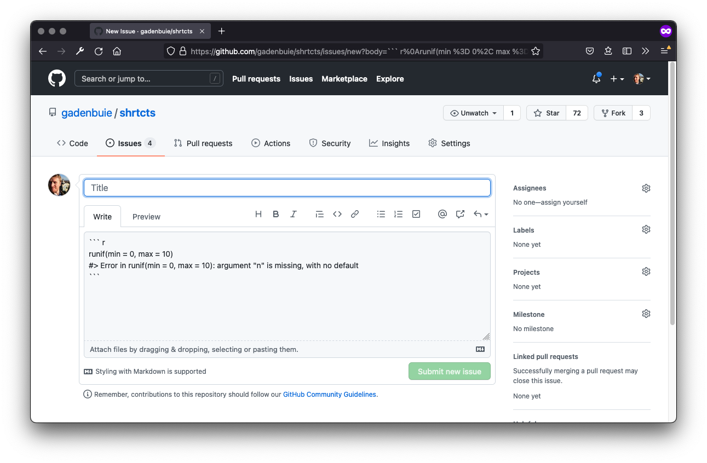

[reprex]: https://reprex.tidyverse.org/
[shrtcts]: https://pkg.garrickadenbuie.com/shrtcts
[rstudioapi]: https://rstudio.github.io/rstudioapi/
[roxygen2]: https://roxygen2.r-lib.org/

::: lead

Have you ever spent a few ~~minutes~~ hours turning a bug in your code
into a [reprex] -- a minimumal **repr**oducible **ex**ample?

Getting to a reprex is 90% of the challenge.
Most of the time, I find my mistake in the journey to a reprex.
But sometimes, I find a legitimate bug and in those cases,
I want to quickly turn my reprex into a GitHub issue.

Here's a quick way to get there using an RStudio addin and [[shrtcts]]{.pkg}.

:::


```{r setup, echo=FALSE}
xaringanExtra::use_panelset(in_xaringan = FALSE)
xaringanExtra::use_clipboard(selector = "pre.r")
xaringanExtra::style_panelset_tabs(
  foreground = "var(--text-mild)",
  active_foreground = "var(--text-dark)",
  active_background =  "var(--text-lightest)",
  active_border_color = "var(--purple)",
  hover_background =  "var(--text-lightest)",
  hover_border_color = "var(--text-lightest)",
  inactive_opacity = 1,
  tabs_border_bottom = "var(--text-lightest)",
  font_family = 'unset'
)
```

```{css echo=FALSE}
.panel {
  border: var(--text-lightest) 2px solid;
  border-top: none;
  margin-top: -1em;
  margin-bottom: 1rem;
  padding: 1rem;
  box-sizing: border-box;
  max-height: 80vh;
  overflow-y: auto;
}
.panel > :last-child {
  margin-bottom: 0;
}
```


## `reprex` is awesome

The [[reprex]]{.pkg} package is **awesome**.
If you've never used it before,
I highly recommend that you stop reading this blog
and go watch [Sharla Gelfand's _make a reprex... please_](https://youtu.be/G5Nm-GpmrLw?t=60)
(or [read the slides from the talk](https://make-a-reprex-please.netlify.app/)).

Your goal when making a reprex is to come up with a short bit of code
that demonstrates the problem you've experienced
and that is as self-contained as possible.

To disentangle your problem from your personal R environment,
[reprex]{.pkg} takes your code,
runs it in an isolated environment,
and returns a rendered version of your code
that's ready to be copy-pasted into a text box 
on a number of common websites where R users go for help.

This last feature is one of my favorites:
the rendered format of a `reprex` 
is the perfect way to start crafting a GitHub issue.
Typically, I'll work out the reprex locally,
then use the **Reprex selection** RStudio addin to render the code,
and finally jump over to the issues tab of a GitHub repo to paste the code right there.

Here's an example reprex from [Sharla's talk](https://make-a-reprex-please.netlify.app/#33).
We start with plain [R code](/blog/shrtcts-reprex-to-issue/?panelset=r-code#panelset_r-code).
[reprex]{.pkg} renders the R code with additional information about my session
and [shows me a preview](/blog/shrtcts-reprex-to-issue/?panelset=reprex-preview#panelset_reprex-preview).
And finally it also copies [the markdown I need](/blog/shrtcts-reprex-to-issue/?panelset=clipboard#panelset_clipboard)
in order to paste the reprex into a GitHub issue or other online location.

:::::: panelset
::: panel
[R Code]{.panel-name}

```{r reprex-example, eval = FALSE}
library(tidyverse)

tibble(date = "2020-01-01") %>%
  mutate(year = case_when(
    date <= "2020-12-31" & date >= "2020-01-01" ~ 2020,
    is.na(date) ~ NA
  ))
```
:::

::: panel
[Reprex Preview]{.panel-name}

```{r reprex-output, echo=FALSE, results="hold", message=FALSE}
tmpfile <- tempfile("reprex", fileext = ".R")
writeLines(knitr::knit_code$get("reprex-example"), tmpfile)
rprx <- reprex::reprex(input = tmpfile, venue = "gh", session_info = TRUE, advertise = TRUE)
rprx <- paste(rprx, collapse = "\n")
```

`r rprx`
:::

::: panel
[Clipboard]{.panel-name}

````markdown
`r rprx`
````
:::

::::::


## But wait, there's more!

When you're working on debugging something,
going from code in your RStudio IDE to something you can share with others is **huge**.
But [reprex]{.pkg} can do more!

Because reprex uses `knitr::spin()` —
[_knitr's best hidden gem_ according to Dean Attali](https://deanattali.com/2015/03/24/knitrs-best-hidden-gem-spin/) —
to turn R code into an R Markdown document,
you have a few more options.

`knitr::spin()` has a cool feature that lets you write markdown _in an R script_.
You can check out 
[Dean Attali's post](https://deanattali.com/2015/03/24/knitrs-best-hidden-gem-spin/)
for more details,
but the gist is this:
any text on a line starting with a special comment format `#'` 
becomes markdown.

This means we can add text directly to our reprex using these comments!
Below you can see that I've added some exposition around the problematic code.


:::::: panelset
::: panel
[R Code]{.panel-name}

```{r reprex-example-comments, eval = FALSE}
#' I'm using the latest version of the `tidyverse`, 
#' freshly installed.
library(tidyverse)

#' Suppose we have a data frame with a date column. 
#' The date is stored as a _character_ vector, and 
#' I'd like to convert it to a _year_ with a simple
#' comparison. The first function I thought of was 
#' `case_when()`, but it doesn't seem to be doing 
#' what I expect. Why am I getting this error?
tibble(date = "2020-01-01") %>%
  mutate(year = case_when(
    date <= "2020-12-31" & date >= "2020-01-01" ~ 2020,
    is.na(date) ~ NA
  ))
```
:::

::: panel
[Reprex Preview]{.panel-name}

```{r reprex-output-comments, echo=FALSE, results="hold", message=FALSE}
tmpfile <- tempfile("reprex", fileext = ".R")
writeLines(knitr::knit_code$get("reprex-example-comments"), tmpfile)
rprx2 <- reprex::reprex(input = tmpfile, venue = "gh", session_info = TRUE, advertise = TRUE)
rprx2 <- paste(rprx2, collapse = "\n")
```

`r rprx2`
:::

::: panel
[Clipboard]{.panel-name}

````markdown
`r rprx2`
````
::::

::::::


## There should be a shortcut

Kick-starting an issue report using a reprex 
right from within my RStudio session is great,
but there's still the part where I have to slog
out of my IDE, 
into a browser,
and find my way to the repo where this issue should go.

Most of the time, though, I'm already **in the repo**.
And [usethis]{.pkg} has 
[a helpful function](https://usethis.r-lib.org/reference/browse-this.html) 
to get me right to the issues page:

```{r eval=FALSE}
usethis::browse_github_issues()
```

But there's too much typing.
I want reprex to issue, _with magic_ &#x1F9D9; &#x2728;.

So that's what we'll do!
In the rest of this post,
we'll use [reprex]{.pkg} and the [[rstudioapi]]{.pkg} package 
to automatically go from code to GitHub issue.
Then we'll wrap that logic into a function
and turn it into an RStudio Addin with my package, [[shrtcts]]{.pkg}.

## From reprex to issue

Suppose we have some `input` code and a target `repo`.
Maybe we have a classic missing argument error 
and we want to send the issue to [gadenbuie/shrtcts](https://github.com/gadenbuie/shrtcts)
(please don't!).

```{r inputs}
input <- "runif(min = 0, max = 10)\n"
repo <- "gadenbuie/shrtcts"
```

### Prepare the issue body

Our goal is to render the reprex into an issue `body`
and then we'll put together a URL
that takes us to GitHub's 
[new issue page](https://github.com/gadenbuie/shrtcts/issues/new)
for the `repo` with the issue `body` pre-filled when we get there.


```{r url_new_issue, eval=FALSE, echo=FALSE}
url_new_issue <- glue::glue("https://github.com/{repo}/issues/new?body={body}")
```

```{r url_new_issue_browse, eval=FALSE, echo=FALSE}
browseURL(url_new_issue)
```

```{r url_new_issue_preview, eval=FALSE}
body <- "... reprex body goes here ..."
<<url_new_issue>>
<<url_new_issue_browse>>
```

The trick here is that you can create a new issue by going to
`github.com/{owner}/{repo}/issues/new`
and we're sending along the initial body using
[the query string](https://url.spec.whatwg.org/#dom-urlsearchparams-urlsearchparams)
`?body={body}`.

To put together the `body`, we first render the `input` using `reprex::reprex()`

```{r body_reprex, eval=FALSE}
body <- reprex::reprex(input = input, venue = "gh", html_preview = TRUE)
```

where we've asked for a reprex for GitHub — `venue = "gh"` — 
and a local HTML preview — `html_preview = TRUE`.
You can adjust the arguments to `reprex()` to fit your needs, of course.

Unfortunately, `reprex::repex()` is only half the work...

```{r, message = FALSE}
<<body_reprex>>
body
```

Notice that it returns a character vector
with one item per line of the rendered reprex.
We need to collapse it all into a single string.

```{r body_paste}
body <- paste(body, collapse = "\n")
```
```{r echo=FALSE}
body
```

But this still won't fit in a URL
because it contains spaces, new lines, and other characters URLs don't like.
So we need to use the base R function `URLencode()`
to turn the `body` text into something readable only by machines.

```{r body_encode}
body <- URLencode(body, reserved = TRUE)
```
```{r echo=FALSE}
body
```

Finally, we can make our new issue URL.

```{r}
<<url_new_issue>>
url_new_issue
```

I didn't make the link clickable, 
but if you were to follow it, 
you'd find a brand new issue page ready for you.



### Grab the input from the user

Of course, 
we don't want to have to define `input` manualy every time we run this function.
Instead, we'd rather get the `input` code from

- the current selection in RStudio
- or the clipboard if nothing is selected

To make things easy, 
we'll ignore the fact that RStudio has a multiple cursors feature,
and we'll just get the first selection of code.
We'll use the `getSourceEditorContext()` to get the currently open text file,
then we can grab the text from the first selection in that editor window.

```{r get_source_editor_context, eval=FALSE}
ctx <- rstudioapi::getSourceEditorContext()
selection <- ctx$selection[[1]]$text
```

If nothing is selected, `selection` will be an empty string, `""`,
in which case we'd prefer to leave `input` as `NULL` 
so that `reprex()` will look in the clipboard for our input.
We also need to make sure that `input` ends with a new line character, `"\n"`,
so that `reprex()` knows that `input` contains the reprex code and not a path to a file.

```{r input_prep, eval=FALSE}
input <- if (nzchar(selection)) {
  paste0(selection, "\n")
}
```

We'll be wrapping this up in a function where
`input` might be provided by the user,
so we'll only want to check for a selection if `input` is `NULL`.

```{r input_not_null, eval=FALSE, style = TRUE}
if (is.null(input)) {
  <<get_source_editor_context>>
  <<input_prep>>
}
```

### Pick the repository

Often, I'll be working in the repository where I want to create the issue.
[usethis]{.pkg} does a great job guessing the repository
from the information in a local copy of the repo.
Rather than spending forever writing our own version,
let's just reach into [usethis]{.pkg} with `:::` to call `target_repo_spec()`.

The function returns the current repo in the form `"owner/repo"`,
but since it isn't designed to be user-facing
it throws an unusual error when called from outside a git repository.
We can soften this edge by catching the error with `tryCatch()`
and replacing the error with a `NULL` value.

```{r repo-try-usethis, eval=FALSE}
repo_guess <- tryCatch(
  usethis:::target_repo_spec("source", FALSE), 
  error = function(err) NULL
)
```

Of course, maybe I'll want to create a reprex
in _another_ repository that isn't the one I'm currently working in.
So we can follow up with a prompt asking for the repo,
using our guess from [usethis]{.pkg}.
The prompt is created with the `showPrompt()` function from [rstudioapi]{.pkg}.

```{r repo-ask, eval=FALSE}
repo <- rstudioapi::showPrompt(
  title = "Which repository?", 
  message = "Where should we create the issue? (owner/repo)",
  default = repo_guess
)
```

<p class="center"></p>

Finally, the function we're putting together will also take a `repo` argument
that _might be_ provided when we call it.
In that case, 
we'd wouldn't need to guess or ask for a repo.

```{r repo-final, eval=FALSE, style=TRUE}
if (is.null(repo)) {
  <<repo-try-usethis>>

  <<repo-ask>>
}
```

## Make it a shortcut

The last step in our process is to make it easy to run this code in RStudio,
ideally as an
[RStudio addin](https://rstudio.github.io/rstudioaddins/)
that we can activate from the addins menu or 
[the command palette](https://blog.rstudio.com/2020/10/14/rstudio-v1-4-preview-command-palette/).

This is the exact goal of the [[shrtcts]]{.pkg} package:
[shrtcts]{.pkg} lets you turn any function into an RStudio addin.

### Set up `shrtcts`

If you've never used [shrtcts]{.pkg} before, 
you need to do two things to get started.
First, install the package, 
from [my R-universe](https://gadenbuie.r-universe.dev)
or from [GitHub](https://github.com/gadenbuie/shrtcts).

:::: panelset
::: panel
[R-universe]{.panel-name}

```{r r-universe, eval=FALSE}
# Add my universe to your list of repos
options(repos = c(
  gadenbuie = "https://gadenbuie.r-universe.dev",
  getOption("repos")
))

install.package("shrtcts")
```
:::

::: panel
[GitHub]{.panel-name}

```{r github, eval=FALSE}
# install.packages("remotes")

remotes::install_github("gadenbuie/shrtcts")
```
:::
::::

The next thing to do is to open a `.shrtcts.R` file 
where we'll add our new shortcut.
This is easy to do with `shrtcts::edit_shortcuts()`,
which will offer to create the `.shrtcts.R` file if it doesn't exit.

```{r make-shrtcts-r, eval=FALSE}
shrtcts::edit_shortcuts()
```

```
Would you like to create a new shrtcts file at 
'~/Library/Application Support/shrtcts/.shrtcts.R' (Yes/no/cancel) yes
```

### Creating a shortcut function

We'll write R functions in the `.shrtcts.R` file
and turn them into RStudio addins
by annotating those functions with roxygen-style comments.

We start with a skeleton of a function that takes two arguments: 
`input` and `repo`,
neither of which are required.
Inside the function, we'll do all the steps from above,
which we'll fill in in a second.

```{r shortcut-skeleton}
create_issue_from_reprex <- function(input = NULL, repo = NULL) {
  # guess or ask for repo
  # get current selection, if available
  # render reprex
  # compose new issue URL
  # go to the new issue page!
}
```

Our next step is to turn this function into a shortcut.
Using [[roxygen2]]{.pkg} documentation syntax,
we give the function a title and description —
these will be used as the title and description of the shortcut.
We can also use the `@shortcut` tag to set a keyboard shortcut (if you want),
and the `@interactive` tag lets shortcuts know 
that the addin should be run interactively rather than in the background.

```{r shortcut-roxy, eval=FALSE}
#' Create issue from reprex
#'
#' Creates an issue from the selected or copied reprex.
#'
#' @shortcut Cmd+Ctrl+Shift+R
#' @interactive
<<shortcut-skeleton>>
```

Finally, we can replace our placeholder comments
with all of the code we wrote above.

```{r shortcut-final, eval=FALSE, style=TRUE}
<<shortcut-roxy>>
create_issue_from_reprex <- function(input = NULL, repo = NULL) {
  <<repo-final>>
    
  if (is.null(input)) {
    <<get_source_editor_context>>
    <<input_prep>>
  }
  
  <<body_reprex>>
  <<body_paste>>
  <<url_new_issue>>
  <<url_new_issue_browse>>
  invisible(url_new_issue)
}
```

Load your shortcuts and restart your R session to activate the addin
and you'll be ready to jump from reprex to GitHub issue in no time!

```{r eval=FALSE}
shrtcts::add_rstudio_shortcuts(set_keyboard_shortcuts = TRUE)
```
